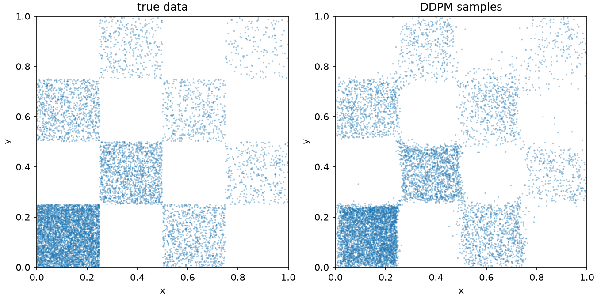
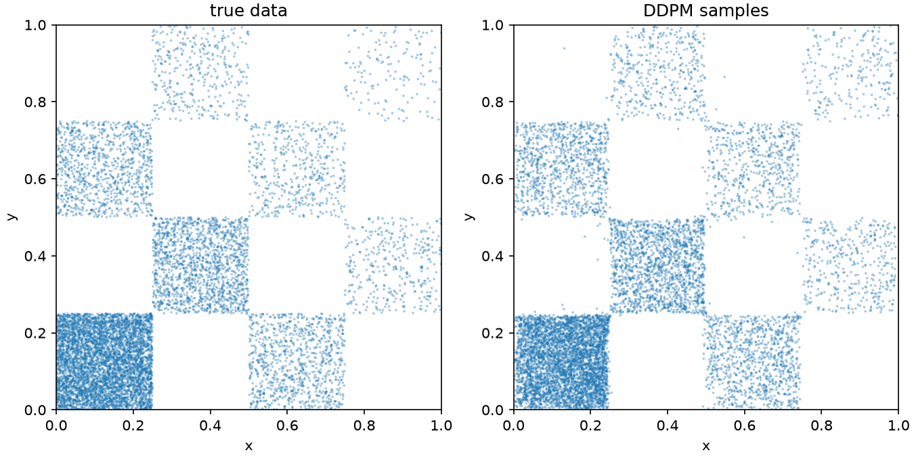
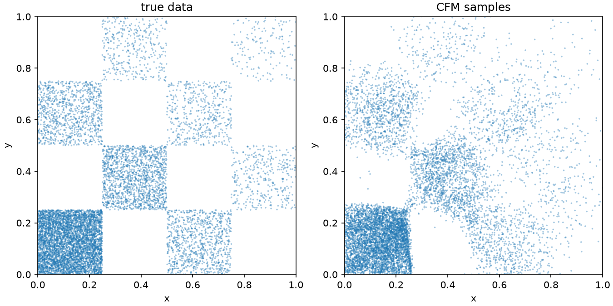
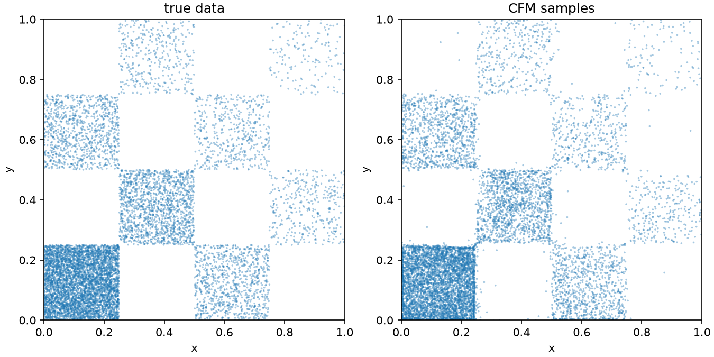
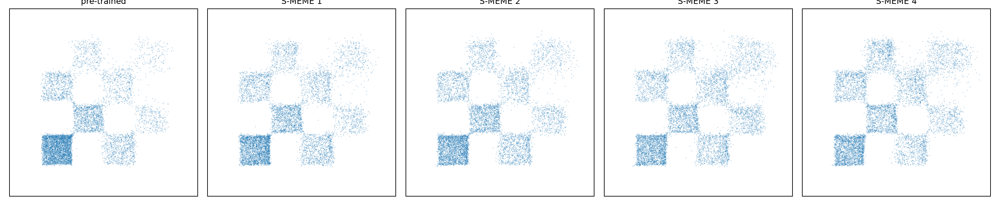
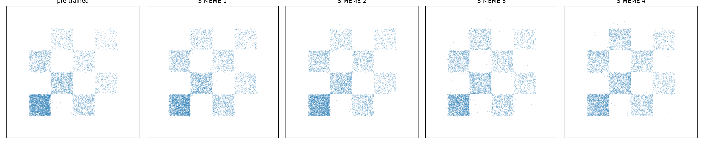
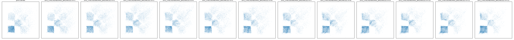
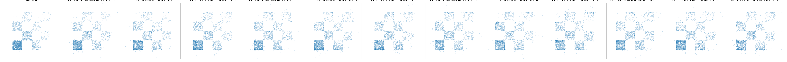

# Feature Representation and Support Learning for 2D Checkerboard Exploration

How much does the spatial representation of a generative model affect its ability to learn a sharp support, and how much does that matter when the model is later fine-tuned for exploration?

We study this question on a biased 2D checkerboard distribution. The target density is deliberately simple but has a discontinuous, disconnected support, so representation errors are easy to see and measure.

We compare two input representations:

- **Raw coordinates**: the model receives spatial coordinates directly.
- **Heat-Gated Fourier Features (HGFF)**: spatial Fourier features whose frequencies are modulated according to the smoothing scale of the generative process. (See `HeatGatedFourierFeatures.pdf` for more details and derivations)

We evaluate the comparison for both [**DDPM**](https://arxiv.org/abs/2006.11239) and [**CFM**](https://arxiv.org/abs/2210.02747) models (we don't outline their formulas here but you can check them in their respective papers).

The experiments test two related hypotheses:

1. HGFF improves recovery of the checkerboard support during pre-training.
2. Better support recovery gives exploration algorithms a better starting geometry and therefore reduces downstream leakage.

> **Note.** The CFM checkpoint shown in the main figures is a particularly challenging run and exhibits more support leakage than several later, better-tuned models. Those runs improved the absolute results but led to the same qualitative conclusions. We use this checkpoint because the relevant representation and exploration effects are especially easy to visualize.

## 1. Support recovery

The first experiment asks whether the pre-trained model learns the active checkerboard tiles without assigning substantial probability to inactive tiles.

| Model | Raw coordinates | HGFF |
| --- | --- | --- |
| DDPM |  |  |
| CFM |  |  |

The important failure mode here is **support leakage**: samples generated inside inactive checkerboard tiles or outside the board. Additionally, the boundaries between active and inactive tiles are considerably sharper with HGFF.

## 2. Exploration after pre-training

We next fine-tune the pre-trained models for exploration.

This stage is especially sensitive to representation error because the exploration algorithm operates on the probability geometry learned during pre-training. Leakage or poorly estimated scores can therefore be amplified during fine-tuning.

### S-MEME with DDPM

#### Raw coordinates

#### HGFF

### Global Flow Expander with CFM

#### Raw coordinates

#### HGFF

## 3. Verifier surrogate for differentiable projection signal

For G-FE, the hard verifier is a binary oracle, but our Adjoint-Matching implementation requires a differentiable projection signal. Rather than using a 0th-order RL fine-tuning method, we therefore introduce a smooth verifier surrogate and obtain its spatial gradient with `grad_of(log_v)`.

**NB**: This surrogate is not a neutral implementation detail. Two smooth functions can induce the same hard valid set while producing very different gradient fields. For example, a nearest-boundary distance penalty can pull invalid samples onto checkerboard boundaries, while another surrogate can direct them toward the interior of a valid component.

With access to a differentiable projection signal (or in our case a surrogate), G-FE depends on two pieces of geometry:

1. the score field learned by the generative model, which drives entropy expansion;
2. the gradient field of the verifier surrogate, which determines how escaped samples are projected back toward validity.

## 4. Conclusion

Feature engineering is a standard idea in ML: choose a representation that makes the structure relevant to the task easier for the model to express. *The biased checkerboard makes this effect unusually visible.*

Diffusion and flow models add an important complication: the same network and spatial representation must operate across an entire noise or flow trajectory. **The spatial structure that matters, however, changes with time.** Near the data distribution, high-frequency features are useful for resolving sharp checkerboard boundaries. At more heavily smoothed timesteps, those same frequencies correspond to structure that has largely disappeared from the target distribution. A fixed high-frequency representation can therefore help at one part of the trajectory while making another part unnecessarily difficult to fit. (See `HeatGatedFourierFeatures.pdf` for more details)

The point of these experiments is **not to argue that HGFF is universally optimal** (or even that this particular construction should transfer directly to other distributions), but to demonstrate in a controlled setting why matching the representation to the time-dependent geometry of the generative process can matter.

Exploration operates on the score or velocity geometry learned by the base model, so errors in support recovery become part of the optimization landscape seen by the exploration method. A representation that models the support more faithfully therefore provides a better starting point for subsequent expansion.

This is intentionally a toy problem.

The checkerboard is useful because:

- its support is known exactly;
- validity is easy to evaluate;
- leakage is visually obvious;
- Gaussian smoothing of the density can be analyzed explicitly;
- disconnected components make exploration failures easy to diagnose.

The results should therefore be interpreted as evidence about optimization and representation behavior, rather than as a claim that HGFF is universally superior for arbitrary high-dimensional generative models.